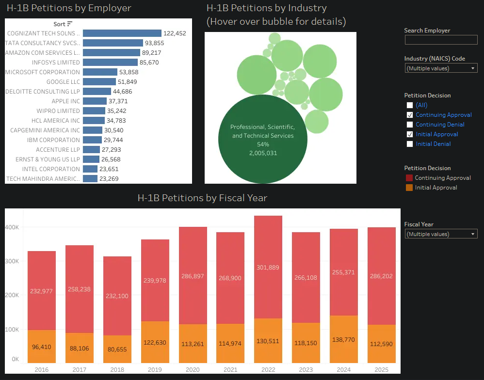

# H-1B Employer Data Hub

[](LICENSE)

A comprehensive data pipeline for processing and analyzing H-1B visa employer data. This project consolidates employer information spanning from 2009 to 2026, transforms it into a unified dataset, and powers an interactive Tableau dashboard for visualization and analysis.

## Overview

H-1B is a visa category in the United States that allows employers to temporarily employ foreign workers. This data hub aggregates historical H-1B employer petition data, providing insights into employment patterns, approvals/denials, and employer trends over time.

### Interactive Dashboard

Explore the data through our interactive Tableau dashboard:

**[H-1B Visa Petitions 2026 Dashboard](https://public.tableau.com/app/profile/john.broberg/viz/H-1BVisaPetitions2026/H-1BVisaPetitions)**

The dashboard visualizes trends, employer statistics, approvals, and denials across multiple years and industries.



## Project Contents

### Data Files

- **`h1b_hub.csv.gz`** - The consolidated H-1B employer dataset used in the Tableau workbook. This compressed CSV contains:
  - Employer information (name, location, state, city, zip code)
  - Fiscal year data (2009-2026)
  - Petition status categories:
    - Initial Approval / Denial
    - Continuing Approval / Denial
  - Aggregated petition counts across multiple petition types

- **`data/`** - Individual annual H-1B employer data files (2009-2026)
  - Each file contains employer petitions for a specific fiscal year
  - Source: [H-1B Employer Data Hub](https://www.uscis.gov/tools/reports-and-studies/h-1b-employer-data-hub)

### Scripts

- **`h1b_employer_datahub.py`** - Main data processing pipeline
  - Consolidates annual CSV files into a unified dataset
  - Standardizes column names and data types
  - Pivots petition types into approval/denial categories
  - Outputs compressed `h1b_hub.csv.gz` for dashboard use

- **`verify_h1b_totals.py`** - Data validation utility
  - Verifies data integrity and completeness
  - Reconciles totals across years
  - Ensures dataset consistency

## Installation

### Prerequisites

- Python 3.7 or higher
- `pandas` library for data processing

### Setup

1. Clone the repository:
   ```bash
   git clone https://github.com/JohnBroberg/H-1B_Employer_Data_Hub.git
   cd H-1B_Employer_Data_Hub
   ```

2. Install dependencies:
   ```bash
   pip install pandas
   ```

## Usage

### Generate the Consolidated Dataset

To regenerate the `h1b_hub.csv.gz` file from source data:

```bash
python h1b_employer_datahub.py
```

This will:
- Read all CSV files from the `data/` directory
- Consolidate and standardize the data
- Create `h1b_hub.csv.gz` ready for analysis

### Verify Data Integrity

To validate the processed data:

```bash
python verify_h1b_totals.py
```

## Data Structure

The `h1b_hub.csv.gz` file contains the following columns:

- `Employer (Petitioner) Name` - Company name
- `Petitioner State` - State of employer
- `Petitioner City` - City of employer
- `Petitioner Zip Code` - ZIP code of employer
- `Fiscal Year` - Year of petition (2009-2026)
- `Initial Approval` - Count of initial employment approvals
- `Initial Denial` - Count of initial employment denials
- `Continuing Approval` - Count of continuing/amended employment approvals
- `Continuing Denial` - Count of continuing/amended employment denials

## License

This project is licensed under the MIT License - see the [LICENSE](LICENSE) file for details.

## Data Attribution

H-1B employer data sourced from the U.S. Citizenship and Immigration Services. For more information on H-1B visa programs and statistics, visit [Understanding Our H-1B Employer Data Hub](https://www.uscis.gov/tools/reports-and-studies/h-1b-employer-data-hub/understanding-our-h-1b-employer-data-hub).
